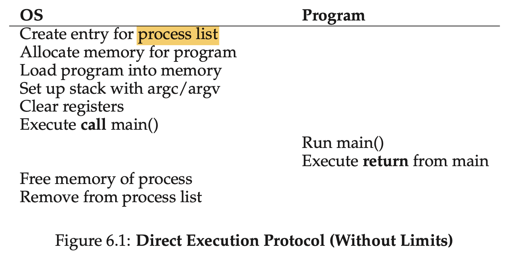

# 6 Mechanism: Limited Direct Execution

THE CRUX: HOW TO EFFICIENTLY VIRTUALIZE THE CPU WITH CONTROL

**performance** 

**control** 

## 6.1 Basic Technique: Limited Direct Execution

**direct execution: ** 最简单的方法，直接运行程序。

**问题：**

1. how can the OS make sure the program doesn’t do anything that we don’t want it to do, while still running it efficiently?
2. how does the operating system stop it from running and switch to another process, thus implementing the **time sharing** we require to virtualize the CPU?

## 6.2 Problem #1: Restricted Operations

**Q: WHY SYSTEM CALLS LOOK LIKE PROCEDURE CALLS？**

The simple reason: it *is* a procedure call, but hidden in- side that procedure call is the famous trap instruction.

**approach：** processor mode：user mode, kernel mode

**Q: what should a user process do when it wishes to perform some kind of privileged operation, such as reading from disk?**

virtually all modern hard- ware provides the ability for user programs to perform a **system call**.

Special instructions to **trap** into the kernel and **return-from-trap** back to user-mode programs are also provided, as well as instructions that allow the OS to tell the hardware where the **trap table** resides in memory.

**Q: how does the trap know which code to run inside the OS?**

The kernel does so by setting up a **trap table** at boot time.

## 6.3 Problem #2: Switching Between Processes

**THE CRUX:** HOW TO REGAIN CONTROL OF THE CPU ?

**A Cooperative Approach:** Wait For System Calls, waiting for a system call or an illegal operation.

**A Non-Cooperative Approach:** a timer interrupt.

