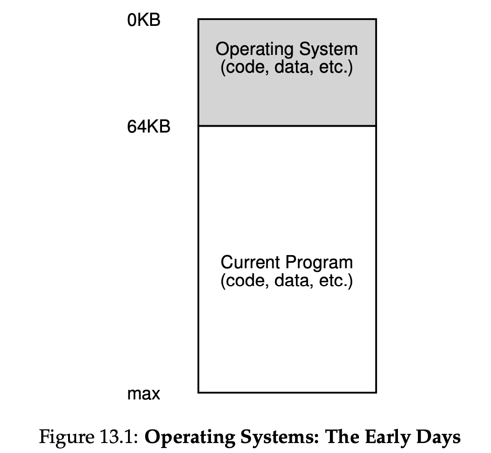

# 13 The Abstraction: Address Spaces

## 13.1 Early Systems

there would be one run- ning program (a process) that currently sat in physical memory (starting at physical address 64k in this example) and used the rest of memory.

## 13.2 Multiprogramming and Time Sharing

**interactivity** ,  **efficiency** 

**One way** to implement time sharing would be to run one process for a short while, giving it full access to all memory (Figure 13.1), then stop it, save all of its state to some kind of disk.

**but,**saving the entire contents of memory to disk is brutally non-performant.

**so**, leave processes in memory while switching between them.

**new demands: ** protection

## 13.3 The Address Space

Address Space的抽象就是每个process认为自己拥有的地址从0开始的地址空间，拥有大的空间。从虚拟地址到物理地址的转化。

